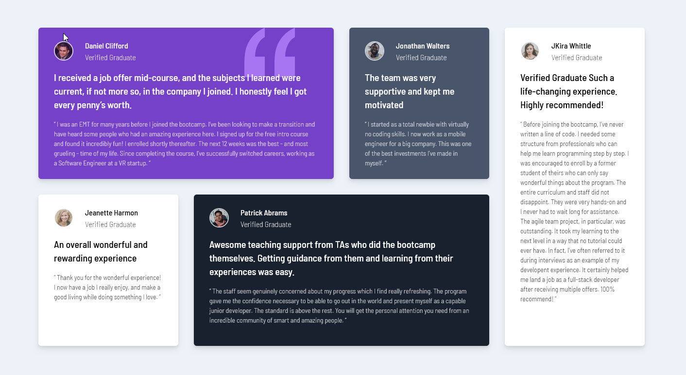

# Frontend Mentor - Testimonials grid section solution

This is a solution to the [Testimonials grid section challenge on Frontend Mentor](https://www.frontendmentor.io/challenges/testimonials-grid-section-Nnw6J7Un7). Frontend Mentor challenges help you improve your coding skills by building realistic projects.

## Table of contents

- [Overview](#overview)
  - [Screenshot](#screenshot)
  - [Links](#links)
- [My process](#my-process)
  - [Built with](#built-with)
  - [What I learned](#what-i-learned)
  - [Continued development](#continued-development)
  - [Useful resources](#useful-resources)
- [Author](#author)

**Note: Delete this note and update the table of contents based on what sections you keep.**

## Overview

### The challenge

Users should be able to:

- View the optimal layout for the site depending on their device's screen size

### Screenshot

    

    

### Links

- Source Code URL: [Source Github](https://github.com/lenez12/testimonials-grid-section-main.git)
- Live Site URL: [Demo Live](https://lenez-testimonial.netlify.app/)

## My process

### Built with

- Semantic HTML5 markup
- CSS custom properties
- Flexbox
- CSS Grid
- Tailwind

### What I learned

what I learned in making this challenge is:

1. i learn how to styling using tailwind library
2. if using tailwind library we should to costumized for in accordance with reqruitments

### Continued development

1. In the future I will make a good css class naming name
2. add animation and transition when hover and activate

### Useful resources

- [W3Schools](https://www.w3schools.com/howto/howto_css_center-vertical.asp)
- [Reset CSS](https://piccalil.li/blog/a-modern-css-reset/)
- [Tailwind](https://tailwindcss.com/)

## Author

- Frontend Mentor - [@Lenez](https://www.frontendmentor.io/profile/yourusername)
- Twitter - [@prak_tech](https://www.twitter.com/prak_tech)

